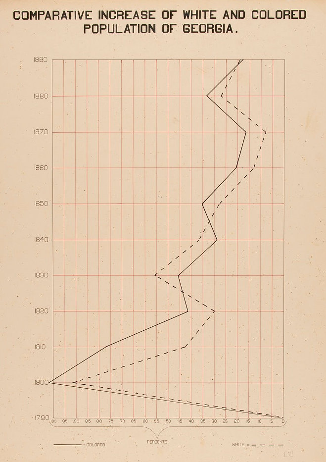

# stand-alone-vizzes

 US Airport Network 
  
 

[Network visualization](https://meglin234.github.io/stand-alone-vizzes/US_Airport_Network/index.html) highlighting the betweenness centrality of the Anchorage airport, made with Gephi. 

 DeBois Recreation 
  
 

[Recreation](https://github.com/meglin234/stand-alone-vizzes/tree/main/DeBois_Recreation) of W. E. B. DeBois' original "Comparative Increase of White and Colored Population of Georgia" visualization using ggplot in R. 

  
  

 Next Thing 
  
 

[link](https://github.com/meglin234/stand-alone-vizzes/tree/main/DeBois_Recreation) 

  
  

